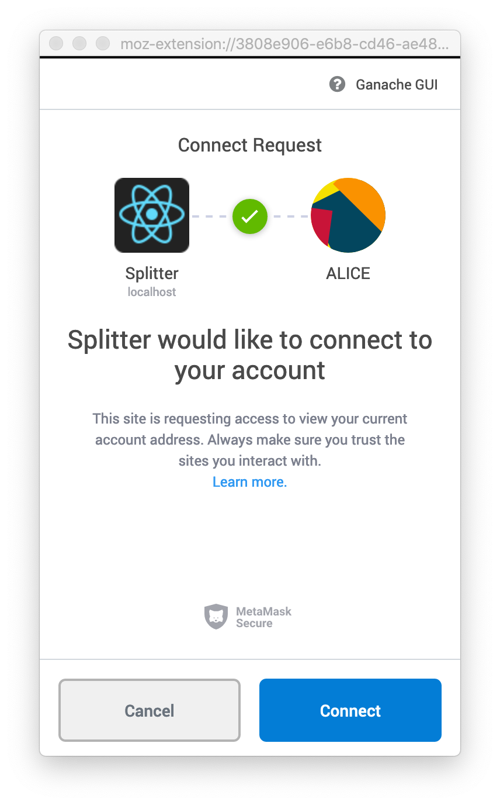
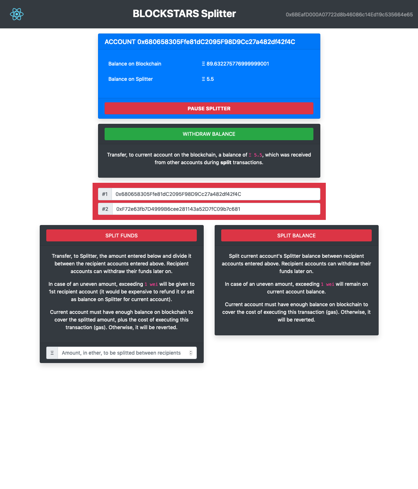

# Splitter

- Course: [B9lab](https://b9lab.com) [Blockstars Certified Ethereum Developer Course](https://blockstars.b9lab.com)
- Cohort: 2019 BLOCKSTARS-ETH-1
- Module: 5
- Author: Fábio Corrêa ([feamcor](https://github.com/feamcor))

## INTRODUCTION

**Splitter** is a decentralized utility smart contract and dapp that receive, split and assign funds to any two recipient accounts. Later on, recipient accounts can withdraw their accumulated balances.

**Splitter** smart contract is written in [Solidity](https://solidity.readthedocs.io/en/latest) for the [Ethereum](https://www.ethereum.org) [blockchain](https://en.wikipedia.org/wiki/Blockchain) using the [Truffle](https://truffleframework.com) framework.

**Splitter** dapp is a [single-page application](https://en.wikipedia.org/wiki/Single-page_application) written in [React.js](https://reactjs.org) and relying on a light-client (wallet), like [MetaMask](https://metamask.io), to sign account transactions.

### FUNCTIONS

**Splitter** exposes the following functions:

- `split` - divides, between two recipient accounts, the **ether** transferred by sender on the transaction (i.e. `msg.value`). In case the transferred amount is uneven, the exceeding **1 wei** is given to 1st recipient account. Sender pays the **gas** for calling this function. Input parameters:

  - `first` - address of the 1st recipient account
  - `second` - address of the 2nd recipient account

- `splitBalance` - divides, between two recipient accounts, the **balance** of the sender held by the contract. In case the balance is uneven, the exceeding **1 wei** is left with the sender. Sender pays the **gas** for calling this function. Input parameters:

  - `first` - address of the 1st recipient account
  - `second` - address of the 2nd recipient account

- `withdraw` - transfer to sender its balance accumulated from previouses executions of `split` and `splitBalance`. Sender pays the **gas** for calling this function.

### EVENTS

**Splitter** also emit the following events:

- `FundsSplitted` - funds were received, divided and credited to recipient accounts. Output parameters:

  - `from` - address of the account which sent funds to recipients
  - `first` - address of 1st recipient account
  - `second` - address of 2nd recipient account
  - `value1st` - amount credited to `first`
  - `value2nd` - amount credited to `second`

- `BalanceSplitted` - balance was divided and credited to recipient accounts. Output parameters:

  - `from` - address of the account which sent balance to recipients
  - `first` - address of 1st recipient account
  - `second` - address of 2nd recipient account
  - `value` - amount credited to recipient accounts

- `BalanceWithdrew` - funds were transferred to recipient account. Output parameters:
  - `by` - address of account who requested withdraw
  - `balance` - outstanding balance of the requestor

### SAFETY

**Splitter** inherits from [Open Zeppelin's Pausable](https://docs.openzeppelin.org/docs/lifecycle_pausable) contract and, as such, exposes functions and emit events related to the implementation of a [circuit breaker](https://consensys.github.io/smart-contract-best-practices/software_engineering/#circuit-breakers-pause-contract-functionality) behavior. The account who deployed the contract is the initial `Pauser` who can **pause/unpause** the contract when needed.

### ESCROW

**Splitter** does not hold any funds **BUT** those received during `split` function execution, and that should be `withdraw` in a timely manner by their rightful recipient accounts. If a recipient doesn't withdraw its balance, such funds will be held by the contract but out of reach of anyone else to recover it (including the contract deployer). There is no concept of contract owner.

Fallback behavior is disabled, not allowing **Splitter** to receive funds from regular fund transfers or erroneous transactions (e.g. calling non-existent functions).

## INSTALLATION

The source code of **Splitter** can be found at [GitHub](https://github.com/feamcor/blockstars_eth_splitter).

1. The following instructions assume that you are using a \*nix-like OS (e.g. Linux, macOS etc.) from its command-line and that [Git](https://git-scm.com/) is already installed.

2. Download and install the latest Node.js release for your OS according to the instructions found at https://nodejs.org.

   - Avoid installing Node.js with `sudo` in order to avoid priviledge issues later on when installing packages and dependencies.
   - On macOS, preferrably install it using the Homebrew package manager found on https://brew.sh.

3. Go to a directory of your preference in your computer (e.g. `~/Desktop`).

4. Download or clone **Splitter** repo to your computer.

```bash
$ git clone https://github.com/feamcor/blockstars_eth_splitter.git
```

5. Go to the new directory.

```bash
$ cd blockstars_eth_splitter
```

6. The structure of directories will be as below.

```
.
├── app
│   ├── public
│   └── src
│       └── contracts -> ../../build/contracts
├── contracts
├── migrations
├── scripts
└── test
    └── helpers
```

7.  The `truffle-config.js` is configured for the following networks:

    - `development` and `ganachecli` using port 8545;
    - `ganachegui` using port 7545;

8.  Install the project dependencies (e.g. truffle, ganache-cli, etc.).

```bash
$ npm install
```

11. Compile **Splitter** and its companion smart contracts.

```bash
$ npx truffle compile
```

12. You should see similar output as below.

```
TO-DO <paste output here>
```

13. Open another terminal window, go to the same directory `blockstars_eth_splitter` and run Ganache CLI.

```bash
$ npx ganache-cli
```

14. You should see similar output as below.

```
TO-DO <paste output here>
```

15. Keep the current terminal window open and switch back to the first terminal window.
16. Migrate (deploy) **Splitter** to Ganache.

```bash
$ npx truffle migrate
```

17. You should see similar output as below.

```
TO-DO <paste output here>
```

18. Run the test script.

```bash
$ npx truffle test
```

19. You should see similar output as below.

```
TO-DO <paste output here>
```

20. **Congratulations!** You have the **Splitter** smart contract running on your machine. This is a typical set-up for development and testing.

## INSTALLATION OF THE DAPP

1. Continuing from the previous section, keep your terminal windows opened and Ganache running.
2. For running the DApp you will need MetaMask to be installed.

   - It works with Chrome and Firefox.
   - Follow the instructions found at https://metamask.io to install the plugin.
   - Configure MetaMask by importing the seed phrase (mnemonic) generated by Ganache on step 16.

3. Go to the `app` directory.

```bash
$ cd app
```

4. Install the project dependencies.

```bash
$ npm install
```

5. Run the DApp using the development server provided by React.

```bash
$ npm start
```

6. You should see similar output as below. Also, your default browser should open on the URL listed below.

```
TO-DO <paste output here>
```

7. MetaMask should ask for authorization to connect the DApp to your account. Press `connect` to proceed.
   

8. The **Splitter** DApp is loaded and ready to be used.
   

9. **Congratulations!** Now you can use the **Splitter** DApp to split funds between two recipient accounts. You should have at least 3 accounts in MetaMask in order to play with the different roles that an account assume: pauser, funds donor and funds recipient. Enjoy!

### INSTALLATION OF THE DAPP (production build)

1. The steps above enabled the development build of the DApp.
2. For production environments, you should use a production build where the app is packaged and optimized.
3. To generate the production build, run the command below.

```bash
$ npm run build
```

4. You should see similar output as below.

```
TO-DO <paste output here>
```

5. For running the production build, first you need to install a static server.

```bash
$ npm install serve --save
```

6. And then you can run the static server using your production build.

```bash
$ npx serve -s build
```

7. You should see similar output as below.

```
TO-DO <paste output here>
```

8. To interrupt the server, press `ctrl-c`
9. **Congratulations!** Now you can use the production build of the **Splitter** DApp. Enjoy!

## LIVE APP ON <ROPSTEN/RINKEBY>

- TO-DO
